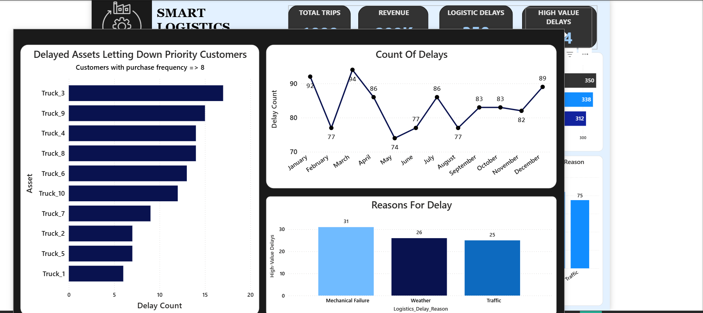

# Smart Logistics Supply Chain Optimization

This project uses Power BI and SQL-based analysis to monitor and improve logistics performance across fleet operations, customer service, and inventory health. The dashboard highlights delays, delay drivers, and revenue-at-risk while surfacing asset and shipment inefficiencies in a single decision-support view.

## Executive Summary

- Total trips: 1,000
- Revenue: $299K
- Logistic delays: 350
- High-value delays: 114
- Average critical wait time: 52.10 minutes
- Inventory coverage: 1.5
- Asset utilization: 80.49%
- Average customer spend: $305.1 vs. target $320.0

## Business Problem

The business was experiencing persistent operational disruption across its delivery network. With 350 delay events recorded across 1,000 trips, the operation was losing time, revenue, and customer trust. Delays were driven by a mix of traffic, weather, and mechanical issues, creating a need for a more actionable and unified performance dashboard.

## What This Dashboard Covers

- Executive performance overview with high-level KPI monitoring
- Operational efficiency analysis by shift, asset, and traffic condition
- Customer insights focused on purchase frequency and spend behavior
- Risk and forecasting for inventory coverage and operational exposure
- Root cause analysis of delay drivers and asset-level bottlenecks

## Repository Contents

- `smart_logistics_dataset.csv` — source logistics dataset
- `SQLQuery1.sql`, `SQLQuery1a.sql`, `SQLQuery2.sql` — SQL preparation and analytics queries
- `SmartLogistics Executive Overview.pbix` — Power BI report file
- `assets/` — dashboard screenshots for GitHub preview

## Key Findings

- Weather is the primary reason for delays, followed by traffic and mechanical failure.
- Customers with purchase frequency 9 generate the highest revenue, but also generate the most delivery friction.
- Priority assets such as Truck_3 and Truck_7 are recurring sources of critical delay events.
- Inventory remains largely healthy, but a meaningful portion still falls into a restock-needed state.
- Customer spend is trending below target, while high-value delay cases remain a strategic risk area.

## Dashboard Preview

### 1. Executive Summary

### 2. Operational Efficiency

### 3. Customer Insights

### 4. Risk and Forecasting

### 5. Root Cause of Delays

### 6. Tooltip View

## Recommended Actions

- Prioritize asset inspection and maintenance for the worst-performing vehicles.
- Add weather-based contingency planning for high-risk operational windows.
- Focus customer retention and service recovery on the highest-value purchase-frequency cohorts.
- Continue monitoring inventory thresholds to avoid service disruption during peak demand periods.

